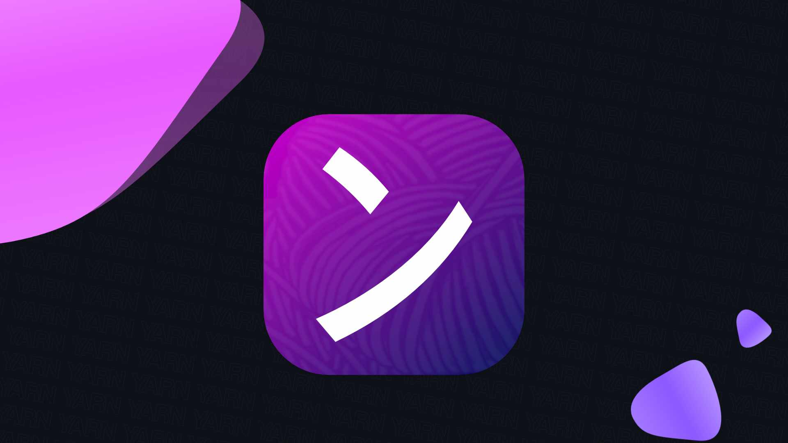

# Your AI-Based Resourceful Network

</img>

This is a [Next.js](https://nextjs.org/) project bootstrapped with [`create-next-app`](https://github.com/vercel/next.js/tree/canary/packages/create-next-app).Combining Social Media with AI with Full Focus Based Interface.

Progress Updates
```markdown
[✓] Implemented Authentication
[✓] Implemented Sign-In
[✓] Implemented Home Page
[✓] Implemented Top Bar
[✓] Implemented Left SideBar
[✓] Implemented Bottom Bar
[✓] Implemented Right SideBar
[✓] Implemented Mobile View
[✓] Implemented Clerk Dark Theme
[✓] Implemented Finalised Home Page
```

# Development Notes

 - Need to Design and Implement Logo (Now Done)
 - Need to Implement Favicon

# APP TIPS

01:03:00

First, run the development server:

```bash
npm run dev
# or
yarn dev
# or
pnpm dev
# or
bun dev
```

Open [http://localhost:3000](http://localhost:3000) with your browser to see the result.

You can start editing the page by modifying `app/page.tsx`. The page auto-updates as you edit the file.

This project uses [`next/font`](https://nextjs.org/docs/basic-features/font-optimization) to automatically optimize and load Inter, a custom Google Font.


